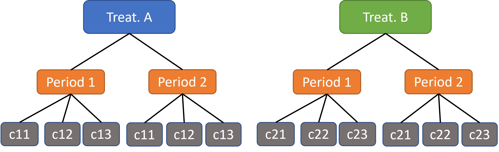

```{r setup, include=FALSE}
knitr::opts_chunk$set(echo = TRUE, warning = FALSE, message = FALSE)
```

## Setup



### Statistical model

$$
Y_{tpki} = \mu + \beta X_t + \theta_{p} Z_{p} + \alpha_k + \gamma_{pk} + \epsilon_{tpki}
$$

where $t$ is the treatment, $p$ is the period, $k$ is the cluster, $i$ is the individual, $\mu$ is the mean for treatment 1, $\beta$ is a fixed effect of treatment, $\theta_{p}$ is the fixed effect of the period, $\alpha \sim N(0, \sigma^2_k)$ is the random effect of the cluster, $\gamma_{pk} \sim N(0, \sigma^2_{pk})$ is the random effect of period*cluster and $\epsilon_{tpki} \sim N(0, \sigma^2_{\epsilon})$. 


### Definitions

$$
\text{ICC} = \frac{\sigma^2_{k} + \sigma^2_{pk}}{\sigma^2_{k} + \sigma^2_{pk} + \sigma^2_{\epsilon}} \quad \text{and} \quad \text{CAC} = \frac{\sigma^2_{k}}{\sigma^2_{k} + \sigma^2_{pk}} 
$$

## Code

```{r}
library(lme4)
library(tidyverse)
library(furrr)

plan("multisession", workers = future::availableCores() - 1)

simulation <- function(m = 1000, mu = 5, beta = 1, period = .5, sd_pk = 1, sd_k = 2, sd_e = 3) { 

  df <- crossing(treat = c("A", "B"), 
                 period = c("1", "2")) %>% 
    crossing(cluster = 1:3) %>% 
    mutate(cluster = paste0(treat, cluster)) %>% 
    crossing(id = 1:m) %>% 
    left_join(crossing(cluster = c("1", "2", "3"),
                       treat = c("A", "B")) %>% 
                transmute(cluster = paste0(treat, cluster)) %>% 
                mutate(alpha = rnorm(nrow(.), 0, sd_k)), by = "cluster") %>% 
    left_join(crossing(cluster = c("1", "2", "3"),
                       treat = c("A", "B")) %>% 
                transmute(cluster = paste0(treat, cluster)) %>% 
                crossing(period = c("1", "2")) %>%  
                mutate(gamma = rnorm(nrow(.), 0, sd_pk)), by = c("period", "cluster"))
    
    
    df$y <- mu + beta * (df$treat == "A") + period*(df$period == 2) + df$alpha + df$gamma + rnorm(nrow(df), 0, sd_e)
    
    fit <- lmer(y ~ treat + period + (1|cluster/period), df)
  
    as.data.frame(VarCorr(fit)) %>% 
      select(grp, sdcor)
  
}


plot <- function(results) {

  results %>% 
    ggplot(aes(sdcor, ..density..)) + 
      geom_histogram(color = "black", fill = "grey") +
      facet_wrap(~ grp, ncol = 1, scales = "free") +
      geom_vline(data = filter(results, grp == "period:cluster"), aes(xintercept = sd_pk), colour = "red", linewidth = 1.2) + 
      geom_vline(data = filter(results, grp == "cluster"), aes(xintercept = sd_k), colour = "red", linewidth = 1.2) + 
      geom_vline(data = filter(results, grp == "Residual"), aes(xintercept = sd_e), colour = "red", linewidth = 1.2) + 
      theme_bw()
  
}
  


icc_cac <- function(results, sd_k, sd_pk, sd_e) {
  
  results %>% 
    mutate(var = sdcor^2) %>% 
    select(-sdcor) %>% 
    pivot_wider(b, names_from = "grp", values_from = "var") %>% 
    mutate(icc = (cluster + `period:cluster`) / (cluster + `period:cluster` + Residual), 
           cac = (cluster) / (cluster + `period:cluster`)) %>% 
    select(-(`period:cluster`:Residual)) %>% 
    pivot_longer(-b, names_to = "coef", values_to = "values") %>% 
    ggplot(aes(values, ..density..)) + 
     geom_histogram(color = "black", fill = "grey") +
     facet_wrap(~ coef, ncol = 1, scales = "free") +
     geom_vline(data = tibble(coef = "icc", values = (sd_k + sd_pk) / (sd_k + sd_pk + sd_e)), 
                aes(xintercept = values), colour = "red", linewidth = 1.2) + 
     geom_vline(data = tibble(coef = "cac", values = (sd_k) / (sd_k + sd_pk)), 
                aes(xintercept = values), colour = "red", linewidth = 1.2) + 
      theme_bw()
  
}
  
  
```


## 500 samples per period\*cluster

```{r}
set.seed(12)

m <- 500    # sample size per period*cluster
mu   <- 10   # mean of trat A
beta <- 2    # fixed effect of treatment B
period <- .5 # fixed effect of periodo
sd_pk <- 1 # sd of random effect for period*cluster
sd_k  <- 2 # sd of random effect for cluster
sd_e  <- 3 # sd of error
B <- 1000  # B datasets and fitted models

results <- tibble(b = 1:B) %>% 
  mutate(table = future_map(b, ~simulation(m, mu, beta, period, sd_pk, sd_k, sd_e))) %>% 
  unnest(table) 
  
plot(results)

icc_cac(results, sd_k, sd_pk, sd_e)

```

## 1000 samples per period\*cluster

```{r}
m <- 10^3    # sample size per period*cluster
mu   <- 10   # mean of trat A
beta <- 2    # fixed effect of treatment B
period <- .5 # fixed effect of periodo
sd_pk <- 1 # sd of random effect for period*cluster
sd_k  <- 2 # sd of random effect for cluster
sd_e  <- 3 # sd of error
B <- 1000  # B datasets and fitted models

results <- tibble(b = 1:B) %>% 
  mutate(table = future_map(b, ~simulation(m, mu, beta, period, sd_pk, sd_k, sd_e))) %>% 
  unnest(table) 
  
plot(results)

icc_cac(results, sd_k, sd_pk, sd_e)
```

## 10000 samples per period\*cluster

```{r}
m <- 10^4    # sample size per period*cluster
mu   <- 10   # mean of trat A
beta <- 2    # fixed effect of treatment B
period <- .5 # fixed effect of periodo
sd_pk <- 1 # sd of random effect for period*cluster
sd_k  <- 2 # sd of random effect for cluster
sd_e  <- 3 # sd of error
B <- 1000  # B datasets and fitted models

results <- tibble(b = 1:B) %>% 
  mutate(table = future_map(b, ~simulation(m, mu, beta, period, sd_pk, sd_k, sd_e))) %>% 
  unnest(table) 
  
plot(results)

icc_cac(results, sd_k, sd_pk, sd_e)

```
